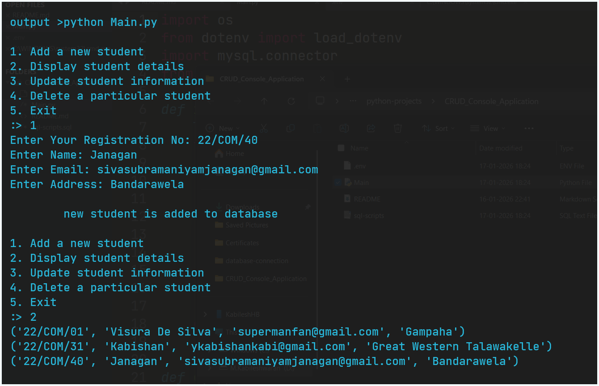
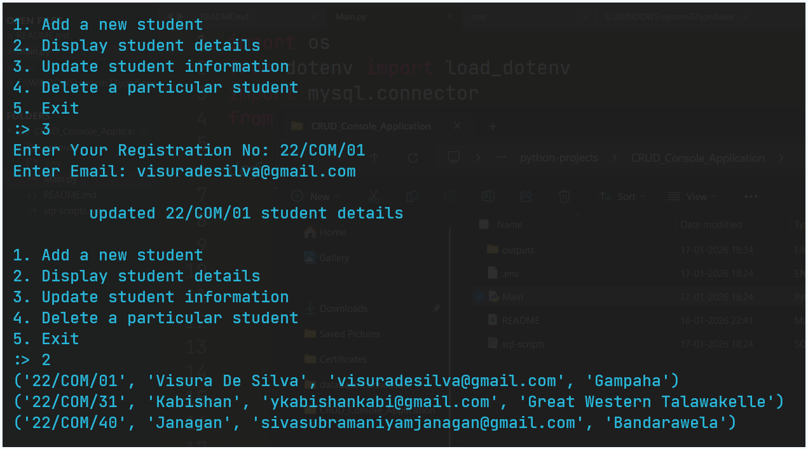
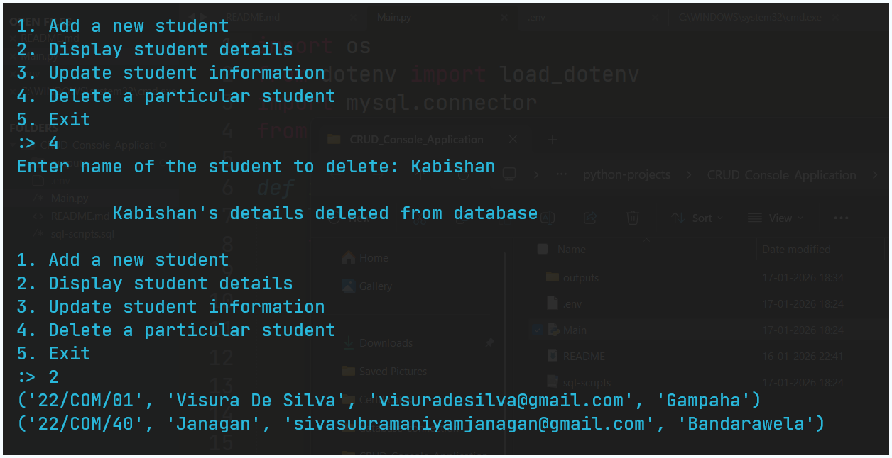
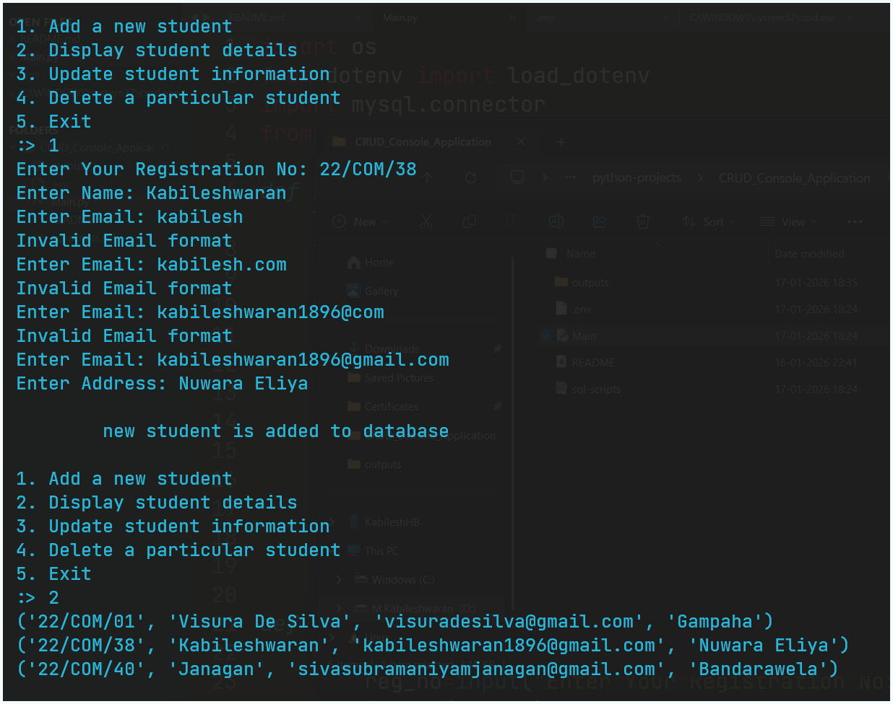
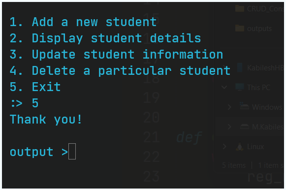

## Basic CRUD Python Console Application

This is a basic **console-based CRUD application** built using **Python** and **MySQL**.  
The project uses the `mysql-connector-python` library to establish a connection between Python and a MySQL database.

---

## 📌 Project Overview

The application performs basic **CRUD operations** on a student database.

- **Database Name:** `StudentsDB`
- **Table Name:** `Students`

The console menu of the application looks like this:

```text
1. Add a new student
2. Display student details
3. Update student information
4. Delete a particular student
5. Exit
```

## 🛠️ Requirements
Before running the application, ensure you have the following installed:

- Python
- MySQL Server
- MySQL Workbench (optional but recommended)

📦 Install MySQL Connector for Python

Run the following command in your command prompt or terminal:
```bash
pip install mysql-connector-python
```

## 🗄️ MySQL Setup

Make sure MySQL is installed and running on your system.

You can download and install MySQL (including MySQL Workbench) from here:
[MySQL Installer Download](https://dev.mysql.com/downloads/installer/)

Create the required database and table before running the application, or ensure the script handles table creation.

## 🚀 How to Run the Project

Clone the repository:

```bash
git clone https://github.com/KabileshwaranKabil/python-projects.git
```

Navigate to the project directory:
```bash
cd CRUD_Console_Application
```

Run the application:
```bash
python Main.py
```
## 🎯 Learning Outcome

By working on this project, you will understand:
- How to connect Python with MySQL
- How to perform Create, Read, Update, and Delete (CRUD) operations
- How a console-based database application works
- Proper use of database connections and cursors

## Output





